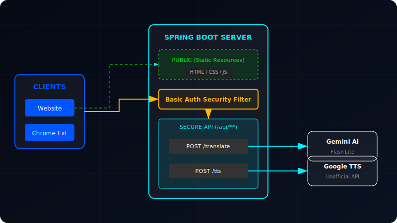

# Moroccan AI Translate

A next-generation Spring Boot translation engine that bridges English and Moroccan Arabic (Darija) using **Google Gemini 2.5 Flash Lite**, featuring a cyberpunk "Neo-Maghreb" aesthetic and robust Text-to-Speech capabilities.

## ✨ Features
*   **Gemini 2.5 Flash Lite:** Optimized for speed and higher rate limits.
*   **Neo-Maghreb Frontend:** A stunning, dark-mode interface inspired by cyberpunk aesthetics and Moroccan geometry.
*   **Text-to-Speech (TTS):** Hear the translation in Arabic using a custom backend proxy that ensures high-quality audio bypassing browser restrictions.
*   **Chrome Extension:** Translate instantly from your browser's side panel with full TTS support.
*   **Secure API:** Endpoints are secured using Basic Authentication (Spring Security).
*   **Developer Friendly:** Clean REST API with comprehensive documentation.

## 🏗 Architecture



The application is built on Spring Boot 3 and divided into three main layers:

### 1. The Client (`WebController` + Frontend)
*   **Role:** Serves the "Neo-Maghreb" UI.
*   **Tech:** Thymeleaf, CSS3 (Glassmorphism), Vanilla JS.
*   **Access:** `http://localhost:1000/`

### 2. The Chrome Extension
*   **Role:** Provides side-panel access to the translator.
*   **Tech:** Manifest V3, Service Workers.
*   **Location:** `/chrome-extension` folder.

### 3. The Secure Web Service (`TranslatorRestController`)
*   **Role:** The engine room providing two core endpoints:
    *   `POST /api/translate`: Orchestrates calls to the Gemini API via `TranslationService`.
    *   `POST /api/tts`: A proxy endpoint that securely fetches audio from Google TTS to bypass CORS/ORB restrictions.
*   **Security:** Basic Auth (`user` / `password`).

## 🚀 Getting Started

### Prerequisites
- Java 17 or later
- Maven 3.8+
- A Google Gemini API Key

### Configuration
1.  Open `src/main/resources/application.properties`.
2.  Set your API key: `api.key=YOUR_KEY_HERE`
3.  (Optional) Change default credentials:
    ```properties
    spring.security.user.name=user
    spring.security.user.password=password
    ```

### Running the App
```bash
mvn spring-boot:run
```
Server starts on: `http://localhost:1000`

## 🛠 Usage Guide

### 1. Web Interface
Visit `http://localhost:1000` to experience the animated interface. The site handles authentication automatically for you.

### 2. Chrome Extension
1.  Go to `chrome://extensions/`.
2.  Enable **Developer Mode**.
3.  Click **Load Unpacked**.
4.  Select the `chrome-extension` folder from this project.
5.  Open the side panel and start translating!

### 3. REST API (for Developers)
The API is secured. You must provide Basic Auth credentials.

**Translate Text:**
```bash
curl -u user:password -X POST \
  -H "Content-Type: application/json" \
  -d '{"text":"Hello friend"}' \
  http://localhost:1000/api/translate
```

**Get Audio (TTS):**
```bash
curl -u user:password -X POST \
  -H "Content-Type: application/json" \
  -d '{"text":"السلام عليكم"}' \
  --output audio.mp3 \
  http://localhost:1000/api/tts
```

## 📚 Technical Docs
*   **Gemini JSON Docs:** [Google's Documentation](https://ai.google.dev/api/generate-content#v1beta.models.generateContent).
*   **TTS Journey:** Read about how we built the TTS feature in [TTS_IMPLEMENTATION_JOURNEY.md](TTS_IMPLEMENTATION_JOURNEY.md).